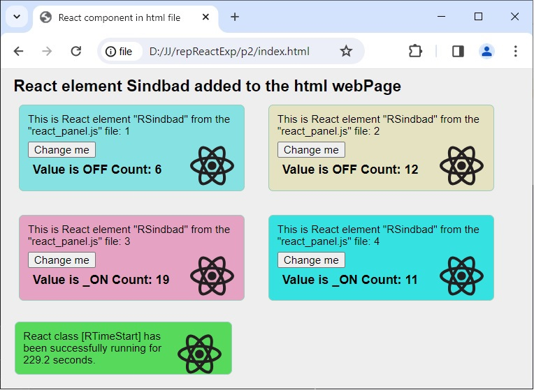

# Simple React elements in one .html file

This is a regular html page. This page demonstrates using React with no build tooling. A React element was injected into it and duplicated 4 times with different attributes (colors). You can see that React elements can be added gradually to old HTML pages and there is no need to rebuild the entire existing website from scratch.

React elements are defined here without JSX syntax (Babel preprocessor) and in native mode, without compilation. The browser reads the index4.html file. This is the simplest way to use React elements.

- React without NPM, without JSX syntax;
- Project in files: 1 .html, 2 .css, 2 .js;
- Defined one React Class_Component in different file react_panel.js;
- Component used 5 times in different divs.
- Each instance has its own counter from [state full];
- Adding React element to a regular html webpage;

.

## Details

- React ver.18 sources are linked online from the internet;
- Project written in Visual Studio Code;
